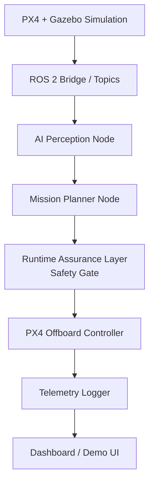

# SentinelFlight

**A safety-aware UAV autonomy stack that separates AI-generated flight
decisions from safety-critical commands using a deterministic runtime
assurance layer.**

SentinelFlight combines PX4 + ROS 2 for flight control, edge AI for
perception, and a runtime assurance layer that validates every AI-generated
command before it reaches the flight controller. The AI proposes; the
safety gate disposes.

> **Status:** the runtime assurance layer (the architectural centerpiece of
> this project) is implemented and unit tested. The PX4/ROS 2/Gazebo
> simulation, perception, and dashboard layers are designed and scaffolded
> but require a Linux/WSL2 environment to build out — see
> [docs/roadmap.md](docs/roadmap.md) for exactly what's done vs. planned.
> I'm being upfront about this because half-finished-but-labeled work is
> worse than an honest roadmap.

## Why this matters

Autonomous systems that let an AI model directly control safety-critical
hardware are risky — models are confidently wrong, cameras get occluded,
and perception pipelines degrade under real-world conditions. SentinelFlight
is built around a small, deterministic, independently-testable safety
monitor that sits between the AI stack and the flight controller, similar
in spirit to runtime assurance architectures used in real autonomy systems.

## System architecture



Full breakdown, topic list, and package responsibilities:
[docs/architecture.md](docs/architecture.md).

## Tech stack

- **Flight control:** PX4 Autopilot, ROS 2 Humble, Gazebo (planned — see roadmap)
- **Runtime assurance:** pure Python state machine, `pytest`
- **Perception (planned):** OpenCV (ArUco) → YOLOv8n/MobileNet SSD, ONNX/TensorRT
- **Dashboard (planned):** FastAPI + React + WebSocket
- **Edge deployment (planned):** NVIDIA Jetson Orin Nano

## Safety layer

The runtime assurance layer validates every proposed setpoint against:

- Altitude limits (1m–20m)
- Velocity limits (3 m/s horizontal, 1 m/s vertical)
- A geofence (±20m box)
- AI confidence thresholds (hover below 0.70, land below 0.50)
- Stale-command timeouts (hover at 500ms, land at 3s)
- Obstacle proximity (halt forward motion within 2m)
- Repeated-rejection mission abort (5 consecutive unsafe proposals)

Full design, state machine diagram, and test matrix:
[docs/safety_layer.md](docs/safety_layer.md).

## Features

- [x] Deterministic runtime assurance / safety gate with 14-case unit test suite
- [ ] PX4 + Gazebo simulated quadcopter
- [ ] ROS 2 offboard control (takeoff, waypoint nav, hover, land)
- [ ] Landing-pad detection (OpenCV → learned model)
- [ ] Mission planner state machine
- [ ] Telemetry + safety-event logging (CSV/SQLite)
- [ ] Live dashboard
- [ ] Edge deployment on Jetson Orin Nano
- [ ] Simulation-based failure-mode validation report

## Demo scenarios

See [docs/demo_scenarios.md](docs/demo_scenarios.md) for the safety-gate
scenarios runnable today and the target end-to-end mission demo.

## Repo layout

```
sentinelflight/
  README.md
  docs/                    architecture, safety layer, roadmap, demo scenarios, resume bullets
  ros2_ws/src/
    sentinel_flight_control/     safety_gate.py (implemented), mission_manager.py, offboard_controller.py
    sentinel_flight_perception/  landing_pad_detector.py
    sentinel_flight_telemetry/   telemetry_logger.py
  dashboard/
    backend/ frontend/
  models/
    landing_pad_detector/ obstacle_detector/
  scripts/
    launch_sim.sh run_mission.sh analyze_logs.py
  tests/
    test_safety_gate.py
  logs/ media/
```

## How to run

### What runs today (no ROS 2/PX4/Gazebo required)

```bash
python -m venv .venv
.venv\Scripts\activate        # Windows
# source .venv/bin/activate   # macOS/Linux
pip install -r requirements.txt
pytest tests/ -v
```

This exercises the full safety gate test matrix — 14 passing cases covering
altitude, velocity, geofence, AI confidence, stale-command, obstacle
proximity, battery, and mission-abort scenarios.

### What requires the full stack (planned)

The simulation, offboard control, perception, and dashboard layers require
Ubuntu 22.04 (or WSL2) with ROS 2 Humble, PX4 Autopilot, and Gazebo
installed. See [docs/roadmap.md](docs/roadmap.md) for the setup sequence.

## Results

No simulation-based validation report yet — will be added once the PX4/
Gazebo pipeline is running. The safety-gate unit test results are in
[docs/safety_layer.md](docs/safety_layer.md).

## Future work

See [docs/roadmap.md](docs/roadmap.md) for the full phase-by-phase plan,
including GPS-denied navigation with sensor fusion, Jetson deployment with
TensorRT optimization, and multi-agent simulation.

## Resume bullets

See [docs/resume_bullets.md](docs/resume_bullets.md) — matched to what's
actually implemented at any given point, so claims stay accurate.

## License

[MIT](LICENSE)
