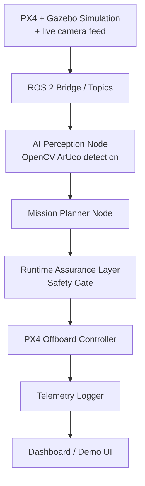

# SentinelFlight

**A safety-aware UAV autonomy stack that separates AI-generated flight
decisions from safety-critical commands using a deterministic runtime
assurance layer.**

SentinelFlight combines PX4 + ROS 2 for flight control, edge AI for
perception, and a runtime assurance layer that validates every AI-generated
command before it reaches the flight controller. The AI proposes; the
safety gate disposes.

> **Status:** the runtime assurance layer (the architectural centerpiece of
> this project) is implemented and unit tested, PX4 SITL + Gazebo boots a
> simulated x500 quadcopter end-to-end, and the mission runs as five
> separate ROS 2 nodes — landing-pad perception, a mission planner, the
> safety gate, the PX4 offboard controller, and the telemetry logger —
> connected over a real `sentinel_flight_msgs` interfaces package. Landing-
> pad detection uses real OpenCV ArUco marker detection against a live
> Gazebo camera feed, not a stub — verified live: arms, climbs, detects the
> marker, and the safety gate correctly distinguishes "no target claim to
> distrust" from "the mission planner is actually depending on this
> detection" after a live-testing run caught it conflating the two (see
> [evidence/phase5_perception_landing.log](docs/evidence/phase5_perception_landing.log)).
> The confidence-vs-altitude calibration needed to complete a clean,
> uninterrupted autonomous landing in one shot is a documented follow-up,
> not faked — see [docs/roadmap.md](docs/roadmap.md) "Phase 5 notes" for
> exactly what worked, what didn't, and why. The dashboard is designed and
> scaffolded but not yet wired up. I'm being upfront about this because
> half-finished-but-labeled work is worse than an honest roadmap.

## Why this matters

Autonomous systems that let an AI model directly control safety-critical
hardware are risky — models are confidently wrong, cameras get occluded,
and perception pipelines degrade under real-world conditions. SentinelFlight
is built around a small, deterministic, independently-testable safety
monitor that sits between the AI stack and the flight controller, similar
in spirit to runtime assurance architectures used in real autonomy systems.

## System architecture



Full breakdown, topic list, and package responsibilities:
[docs/architecture.md](docs/architecture.md).

## Tech stack

- **Flight control:** PX4 Autopilot, ROS 2 Humble, Gazebo Harmonic — SITL + offboard control (arm/takeoff/hold/land) both working
- **Runtime assurance:** pure Python state machine, `pytest`
- **Perception:** OpenCV ArUco marker detection against a live Gazebo camera feed, working — learned-model upgrade (YOLOv8n/MobileNet SSD, ONNX/TensorRT) planned
- **Dashboard (planned):** FastAPI + React + WebSocket
- **Edge deployment (planned):** NVIDIA Jetson Orin Nano

## Responsible AI Use

AI-assisted development tools were used selectively during this project to support brainstorming, documentation, code scaffolding, and debugging. AI-generated suggestions were treated as untrusted starting points—not final implementations.

All technical decisions, system architecture, integration work, and project direction were determined by the project author. Suggested code and documentation were manually reviewed, adapted, and tested before being included. In particular, safety-critical behavior was validated through deterministic logic and automated tests rather than relying on generative AI output at runtime.

This approach reflects my belief that AI is most effective as an engineering productivity tool when paired with human judgment, technical understanding, verification, and clear accountability.


## Safety layer

The runtime assurance layer validates every proposed setpoint against:

- Altitude limits (1m–20m)
- Velocity limits (3 m/s horizontal, 1 m/s vertical)
- A geofence (±20m box)
- AI confidence thresholds (hover below 0.70, land below 0.50)
- Stale-command timeouts (hover at 500ms, land at 3s)
- Obstacle proximity (halt forward motion within 2m)
- Repeated-rejection mission abort (5 consecutive unsafe proposals)

Full design, state machine diagram, and test matrix:
[docs/safety_layer.md](docs/safety_layer.md).

## Features

- [x] Deterministic runtime assurance / safety gate with 14-case unit test suite
- [x] PX4 + Gazebo simulated quadcopter (SITL boots end-to-end, see roadmap)
- [x] ROS 2 offboard control (arm, takeoff, hold, hand off to land — verified live against SITL)
- [x] Telemetry + safety-event logging (CSV) — verified against a live 5660-row SITL run
- [x] Mission planner state machine — implemented, unit tested (17 cases), and running as its own ROS 2 node over a real `sentinel_flight_msgs` interfaces package
- [x] Landing-pad detection (OpenCV ArUco) — implemented, unit tested (6 cases), running against a live Gazebo camera feed; learned-model upgrade planned
- [ ] Live dashboard
- [ ] Edge deployment on Jetson Orin Nano
- [ ] Simulation-based failure-mode validation report

## Demo scenarios

See [docs/demo_scenarios.md](docs/demo_scenarios.md) for the safety-gate
scenarios runnable today and the target end-to-end mission demo.

## Repo layout

```
sentinelflight/
  README.md
  docs/                    architecture, safety layer, roadmap, demo scenarios, resume bullets
  ros2_ws/src/
    sentinel_flight_msgs/         Setpoint.msg, SafetyEvent.msg, PerceptionStatus.msg (custom interfaces)
    sentinel_flight_control/      safety_gate.py, mission_manager.py (both implemented + unit tested),
                                   mission_manager_node.py, safety_gate_node.py, offboard_controller.py,
                                   ros_interfaces.py, launch/mission.launch.py
    sentinel_flight_perception/   landing_pad_detector.py (implemented + unit tested), landing_pad_detector_node.py
    sentinel_flight_telemetry/    telemetry_logger.py (implemented + unit tested), telemetry_logger_node.py
  dashboard/
    backend/ frontend/
  models/
    landing_pad_detector/ obstacle_detector/
  scripts/
    launch_sim.sh run_mission.sh analyze_logs.py
  tests/
    test_safety_gate.py test_mission_manager.py test_telemetry_logger.py test_landing_pad_detector.py
  logs/ media/
```

## How to run

### What runs today (no ROS 2/PX4/Gazebo required)

```bash
python -m venv .venv
.venv\Scripts\activate        # Windows
# source .venv/bin/activate   # macOS/Linux
pip install -r requirements.txt
pytest tests/ -v
```

This exercises the full safety gate (14 cases), mission planner (17 cases),
telemetry logger (4 cases), and landing-pad detector (6 cases) test suites
— 41 passing cases covering altitude, velocity, geofence, AI confidence,
stale-command, obstacle proximity, battery, mission-abort, mission state
transitions, CSV logging, and ArUco marker detection/offset/confidence.

### PX4 SITL + Gazebo (working, via WSL2 Ubuntu 22.04)

```bash
cd PX4-Autopilot
HEADLESS=1 make px4_sitl gz_x500
```

Boots PX4 SITL against a simulated x500 quadcopter in Gazebo Harmonic and
drops into the interactive `pxh>` shell. See
[docs/evidence/phase1_sitl_gazebo_boot.log](docs/evidence/phase1_sitl_gazebo_boot.log)
for a captured boot, and [docs/roadmap.md](docs/roadmap.md#phase-1-notes-wsl2windows-specific)
for the WSL2-specific setup notes (distro version, NuttX toolchain skip,
headless flag).

To fly against the landing-pad marker (needed for the perception/mission
stack below), use the camera-equipped vehicle and PX4's bundled `aruco`
world instead:

```bash
PX4_GZ_WORLD=aruco HEADLESS=1 make px4_sitl gz_x500_mono_cam_down
```

### ROS 2 mission stack (working, five separate nodes)

With SITL running and `MicroXRCEAgent udp4 -p 8888` bridging PX4 to ROS 2:

```bash
source /opt/ros/humble/setup.bash
cd ros2_ws
colcon build --symlink-install
source install/setup.bash
ros2 launch sentinel_flight_control mission.launch.py
```

Brings up a Gazebo→ROS 2 camera bridge, `landing_pad_detector_node`,
`mission_manager_node`, `safety_gate_node`, `offboard_controller`, and
`telemetry_logger_node` as five separate processes wired together over the
`sentinel_flight_msgs` interfaces package. `landing_pad_detector_node` runs
real OpenCV ArUco detection against the live camera feed;
`mission_manager_node` runs `MissionManager.step()` and publishes a
*proposed* setpoint; `safety_gate_node` is the sole node that decides what
actually reaches PX4; `offboard_controller` is the only node that talks to
PX4 directly (arm, engage OFFBOARD, climb to 5m, hold, hand off to native
AUTO_LAND — triggered either by a real perception-driven landing or a
hold-duration fallback); `telemetry_logger_node` logs one CSV row per tick.
See [docs/evidence/phase5_perception_landing.log](docs/evidence/phase5_perception_landing.log)
and [docs/roadmap.md](docs/roadmap.md#phase-5-notes) for the real issues
hit getting this working, including a Gazebo-Transport-version mismatch
between the apt `ros_gz_bridge` and this PX4 checkout's Gazebo Harmonic
build (fixed by building `ros_gz_bridge`/`ros_gz_image` from source), and a
false-`MISSION_ABORT` bug found via live testing and fixed by teaching the
safety gate when the mission planner is actually depending on a perception
claim vs. merely seeing one. Earlier node-split issues (a startup
`MISSION_ABORT` landmine, broken console-script entry points, a missing
`setup.cfg`) are in [docs/roadmap.md](docs/roadmap.md#phase-4-notes).

### Telemetry analysis (working)

```bash
python scripts/analyze_logs.py logs/mission.csv
```

Summarizes altitude range, AI confidence range, and a safety-status
breakdown for a mission log. See
[docs/evidence/phase5_analysis_output.txt](docs/evidence/phase5_analysis_output.txt)
for real output against the perception-enabled flight above.

### Dashboard (planned)

This layer is designed and scaffolded but not yet wired up. See
[docs/roadmap.md](docs/roadmap.md) for what's next.

## Results

No simulation-based validation report yet — will be added once the PX4/
Gazebo pipeline is running. The safety-gate unit test results are in
[docs/safety_layer.md](docs/safety_layer.md).

## Future work

See [docs/roadmap.md](docs/roadmap.md) for the full phase-by-phase plan,
including GPS-denied navigation with sensor fusion, Jetson deployment with
TensorRT optimization, and multi-agent simulation.


## License

[MIT](LICENSE)