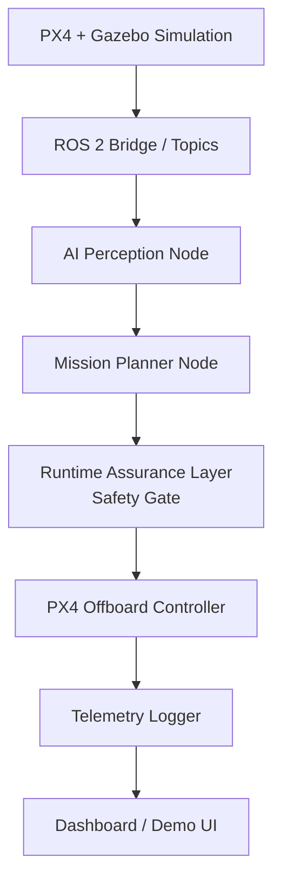

# SentinelFlight

**A safety-aware UAV autonomy stack that separates AI-generated flight
decisions from safety-critical commands using a deterministic runtime
assurance layer.**

SentinelFlight combines PX4 + ROS 2 for flight control, edge AI for
perception, and a runtime assurance layer that validates every AI-generated
command before it reaches the flight controller. The AI proposes; the
safety gate disposes.

> **Status:** the runtime assurance layer (the architectural centerpiece of
> this project) is implemented and unit tested, PX4 SITL + Gazebo boots a
> simulated x500 quadcopter end-to-end, and a ROS 2 node now flies it —
> arms, engages offboard mode, climbs to 5m, holds, hands off to PX4's
> native landing mode, and disarms — with the safety gate evaluating every
> setpoint live against PX4 and telemetry logged for the full mission (see
> [evidence/phase2_offboard_control.log](docs/evidence/phase2_offboard_control.log)
> and [evidence/phase3_analysis_output.txt](docs/evidence/phase3_analysis_output.txt)).
> Perception, the mission planner, and the dashboard are designed and
> scaffolded but not yet wired up — see [docs/roadmap.md](docs/roadmap.md)
> for exactly what's done vs. planned. I'm being upfront about this because
> half-finished-but-labeled work is worse than an honest roadmap.

## Why this matters

Autonomous systems that let an AI model directly control safety-critical
hardware are risky — models are confidently wrong, cameras get occluded,
and perception pipelines degrade under real-world conditions. SentinelFlight
is built around a small, deterministic, independently-testable safety
monitor that sits between the AI stack and the flight controller, similar
in spirit to runtime assurance architectures used in real autonomy systems.

## System architecture



Full breakdown, topic list, and package responsibilities:
[docs/architecture.md](docs/architecture.md).

## Tech stack

- **Flight control:** PX4 Autopilot, ROS 2 Humble, Gazebo Harmonic — SITL + offboard control (arm/takeoff/hold/land) both working
- **Runtime assurance:** pure Python state machine, `pytest`
- **Perception (planned):** OpenCV (ArUco) → YOLOv8n/MobileNet SSD, ONNX/TensorRT
- **Dashboard (planned):** FastAPI + React + WebSocket
- **Edge deployment (planned):** NVIDIA Jetson Orin Nano

## Responsible AI Use

AI-assisted development tools were used selectively during this project to support brainstorming, documentation, code scaffolding, and debugging. AI-generated suggestions were treated as untrusted starting points—not final implementations.

All technical decisions, system architecture, integration work, and project direction were determined by the project author. Suggested code and documentation were manually reviewed, adapted, and tested before being included. In particular, safety-critical behavior was validated through deterministic logic and automated tests rather than relying on generative AI output at runtime.

This approach reflects my belief that AI is most effective as an engineering productivity tool when paired with human judgment, technical understanding, verification, and clear accountability.


## Safety layer

The runtime assurance layer validates every proposed setpoint against:

- Altitude limits (1m–20m)
- Velocity limits (3 m/s horizontal, 1 m/s vertical)
- A geofence (±20m box)
- AI confidence thresholds (hover below 0.70, land below 0.50)
- Stale-command timeouts (hover at 500ms, land at 3s)
- Obstacle proximity (halt forward motion within 2m)
- Repeated-rejection mission abort (5 consecutive unsafe proposals)

Full design, state machine diagram, and test matrix:
[docs/safety_layer.md](docs/safety_layer.md).

## Features

- [x] Deterministic runtime assurance / safety gate with 14-case unit test suite
- [x] PX4 + Gazebo simulated quadcopter (SITL boots end-to-end, see roadmap)
- [x] ROS 2 offboard control (arm, takeoff, hold, hand off to land — verified live against SITL)
- [x] Telemetry + safety-event logging (CSV) — verified against a live 5660-row SITL run
- [ ] Landing-pad detection (OpenCV → learned model)
- [ ] Mission planner state machine
- [ ] Live dashboard
- [ ] Edge deployment on Jetson Orin Nano
- [ ] Simulation-based failure-mode validation report

## Demo scenarios

See [docs/demo_scenarios.md](docs/demo_scenarios.md) for the safety-gate
scenarios runnable today and the target end-to-end mission demo.

## Repo layout

```
sentinelflight/
  README.md
  docs/                    architecture, safety layer, roadmap, demo scenarios, resume bullets
  ros2_ws/src/
    sentinel_flight_control/     safety_gate.py (implemented), mission_manager.py, offboard_controller.py
    sentinel_flight_perception/  landing_pad_detector.py
    sentinel_flight_telemetry/   telemetry_logger.py
  dashboard/
    backend/ frontend/
  models/
    landing_pad_detector/ obstacle_detector/
  scripts/
    launch_sim.sh run_mission.sh analyze_logs.py
  tests/
    test_safety_gate.py
  logs/ media/
```

## How to run

### What runs today (no ROS 2/PX4/Gazebo required)

```bash
python -m venv .venv
.venv\Scripts\activate        # Windows
# source .venv/bin/activate   # macOS/Linux
pip install -r requirements.txt
pytest tests/ -v
```

This exercises the full safety gate test matrix — 14 passing cases covering
altitude, velocity, geofence, AI confidence, stale-command, obstacle
proximity, battery, and mission-abort scenarios.

### PX4 SITL + Gazebo (working, via WSL2 Ubuntu 22.04)

```bash
cd PX4-Autopilot
HEADLESS=1 make px4_sitl gz_x500
```

Boots PX4 SITL against a simulated x500 quadcopter in Gazebo Harmonic and
drops into the interactive `pxh>` shell. See
[docs/evidence/phase1_sitl_gazebo_boot.log](docs/evidence/phase1_sitl_gazebo_boot.log)
for a captured boot, and [docs/roadmap.md](docs/roadmap.md#phase-1-notes-wsl2windows-specific)
for the WSL2-specific setup notes (distro version, NuttX toolchain skip,
headless flag).

### ROS 2 offboard control (working)

With SITL running and `MicroXRCEAgent udp4 -p 8888` bridging PX4 to ROS 2:

```bash
source /opt/ros/humble/setup.bash
source sentinelflight_ws/install/setup.bash
python3 -m sentinel_flight_control.offboard_controller
```

Arms the vehicle, engages OFFBOARD mode, climbs to 5m, holds, then hands off
to PX4's native AUTO_LAND — with `safety_gate.SafetyGate` evaluating every
setpoint before it's published to PX4, and every tick logged to
`logs/mission.csv` via `TelemetryLogger`. See
[docs/evidence/phase2_offboard_control.log](docs/evidence/phase2_offboard_control.log)
and [docs/roadmap.md](docs/roadmap.md#phase-2-notes) for the real issues hit
getting this working (versioned topic names, a GCS-required arming check,
and a genuine safety-gate/landing interaction bug it caught).

### Telemetry analysis (working)

```bash
python scripts/analyze_logs.py logs/mission.csv
```

Summarizes altitude range, AI confidence range, and a safety-status
breakdown for a mission log. See
[docs/evidence/phase3_analysis_output.txt](docs/evidence/phase3_analysis_output.txt)
for real output against the flight above.

### Perception, mission planner, dashboard (planned)

These layers are designed and scaffolded but not yet wired up. See
[docs/roadmap.md](docs/roadmap.md) for what's next.

## Results

No simulation-based validation report yet — will be added once the PX4/
Gazebo pipeline is running. The safety-gate unit test results are in
[docs/safety_layer.md](docs/safety_layer.md).

## Future work

See [docs/roadmap.md](docs/roadmap.md) for the full phase-by-phase plan,
including GPS-denied navigation with sensor fusion, Jetson deployment with
TensorRT optimization, and multi-agent simulation.


## License

[MIT](LICENSE)
s