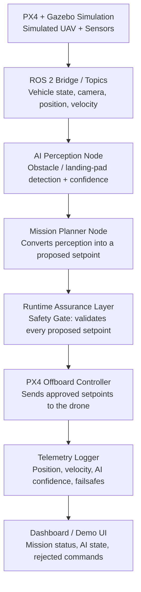

# Architecture

SentinelFlight separates AI-generated mission decisions from safety-critical
flight commands. The AI stack never talks to the flight controller directly
— every command passes through a deterministic runtime assurance layer
first.

## Design principle: mission planner proposes, safety gate disposes

The mission planner (`mission_manager.py`) is allowed to be "smart" — it
reacts to AI perception, chases confidence thresholds, and drives a mission
state machine. But it only ever produces a *proposed* `Setpoint`. The
`SafetyGate` in `safety_gate.py` is the sole authority that decides whether
that setpoint reaches PX4, gets downgraded to a hover/land failsafe, or is
rejected outright.

As of Phase 4 this is enforced across real ROS 2 process boundaries, not
just within one node: `mission_manager_node` and `safety_gate_node` are
separate processes connected only by the `/sentinelflight/proposed_setpoint`
topic, and `offboard_controller` is the only node in the graph that
publishes to any `/fmu/in/*` PX4 command topic — verified live, see
[evidence/phase4_node_decomposition.log](evidence/phase4_node_decomposition.log).

This mirrors how runtime assurance architectures work in real autonomy
stacks: a possibly-unpredictable AI component is wrapped by a small,
deterministic, independently-verifiable safety monitor.

## Package layout

| Package | Responsibility | Depends on ROS 2/PX4? |
|---|---|---|
| `sentinel_flight_control` — `safety_gate.py` | Runtime assurance: altitude/velocity/geofence/confidence/timeout/obstacle checks | No — pure Python, unit tested |
| `sentinel_flight_control` — `mission_manager.py` | Mission state machine (SEARCH → APPROACH_TARGET → ALIGN → DESCEND → LAND) | No — pure Python, unit tested |
| `sentinel_flight_control` — `mission_manager_node.py` | ROS 2 wrapper: runs `MissionManager.step()` on a timer, publishes proposed setpoints | Yes |
| `sentinel_flight_control` — `safety_gate_node.py` | ROS 2 wrapper: runs `SafetyGate.evaluate()` on a timer, publishes safe setpoints + safety events | Yes |
| `sentinel_flight_control` — `offboard_controller.py` | The only node that talks to PX4: offboard handshake, arm, forwards approved setpoints, triggers AUTO_LAND | Yes |
| `sentinel_flight_msgs` | Custom interfaces (`Setpoint.msg`, `SafetyEvent.msg`) shared across nodes | Yes (CMake/rosidl) |
| `sentinel_flight_perception` — `landing_pad_detector.py` | Camera → landing-pad detection + confidence | Yes (OpenCV/model + ROS 2) |
| `sentinel_flight_telemetry` — `telemetry_logger.py` | CSV logging of vehicle state + safety decisions | No — pure Python, unit tested |
| `sentinel_flight_telemetry` — `telemetry_logger_node.py` | ROS 2 wrapper: subscribes to PX4 + SentinelFlight topics, writes one CSV row per tick | Yes |
| `dashboard/` | Live mission status, AI confidence, safety event timeline | Yes (consumes telemetry) |

## Topics

| Topic | Publisher | Subscriber |
|---|---|---|
| `/sentinelflight/perception_status` | Perception node (Phase 5, not yet built) | Mission planner |
| `/sentinelflight/proposed_setpoint` | `mission_manager_node` | `safety_gate_node`, `telemetry_logger_node` |
| `/sentinelflight/safe_setpoint` | `safety_gate_node` | `offboard_controller`, `telemetry_logger_node` |
| `/sentinelflight/safety_event` | `safety_gate_node` | `telemetry_logger_node`, dashboard (planned) |

PX4 topics carry a message-version suffix on this checkout (confirmed live
against SITL via `ros2 topic list`/`topic info`, not assumed from PX4's
unversioned example docs — see [roadmap.md](roadmap.md) "Phase 2 notes"):
`/fmu/out/vehicle_local_position_v1`, `/fmu/out/vehicle_status_v4`,
`/fmu/out/battery_status_v1`, `/fmu/out/vehicle_attitude`. Any node may
subscribe read-only to these; only `offboard_controller` publishes to
`/fmu/in/*` command topics.

See [roadmap.md](roadmap.md) for what's implemented today vs. planned.
