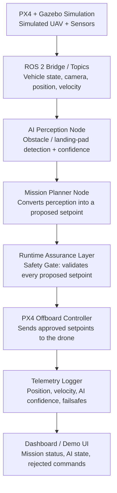

# Architecture

SentinelFlight separates AI-generated mission decisions from safety-critical
flight commands. The AI stack never talks to the flight controller directly
— every command passes through a deterministic runtime assurance layer
first.

## Design principle: mission planner proposes, safety gate disposes

The mission planner (`mission_manager.py`) is allowed to be "smart" — it
reacts to AI perception, chases confidence thresholds, and drives a mission
state machine. But it only ever produces a *proposed* `Setpoint`. The
`SafetyGate` in `safety_gate.py` is the sole authority that decides whether
that setpoint reaches PX4, gets downgraded to a hover/land failsafe, or is
rejected outright.

This mirrors how runtime assurance architectures work in real autonomy
stacks: a possibly-unpredictable AI component is wrapped by a small,
deterministic, independently-verifiable safety monitor.

## Package layout

| Package | Responsibility | Depends on ROS 2/PX4? |
|---|---|---|
| `sentinel_flight_control` — `safety_gate.py` | Runtime assurance: altitude/velocity/geofence/confidence/timeout/obstacle checks | No — pure Python, unit tested |
| `sentinel_flight_control` — `mission_manager.py` | Mission state machine (SEARCH → APPROACH_TARGET → ALIGN → DESCEND → LAND) | No (design stub) |
| `sentinel_flight_control` — `offboard_controller.py` | PX4 offboard handshake: stream setpoints, arm, forward approved commands | Yes |
| `sentinel_flight_perception` — `landing_pad_detector.py` | Camera → landing-pad detection + confidence | Yes (OpenCV/model + ROS 2) |
| `sentinel_flight_telemetry` — `telemetry_logger.py` | CSV/SQLite logging of vehicle state + safety decisions | Yes |
| `dashboard/` | Live mission status, AI confidence, safety event timeline | Yes (consumes telemetry) |

## Topics (planned)

| Topic | Publisher | Subscriber |
|---|---|---|
| `/sentinelflight/perception_status` | Perception node | Mission planner |
| `/sentinelflight/proposed_setpoint` | Mission planner | Safety gate |
| `/sentinelflight/safe_setpoint` | Safety gate | Offboard controller |
| `/sentinelflight/safety_event` | Safety gate | Telemetry logger, dashboard |
| `/px4/vehicle_odometry`, `/px4/vehicle_status` | PX4 | Safety gate, mission planner, telemetry logger |

See [roadmap.md](roadmap.md) for what's implemented today vs. planned.
