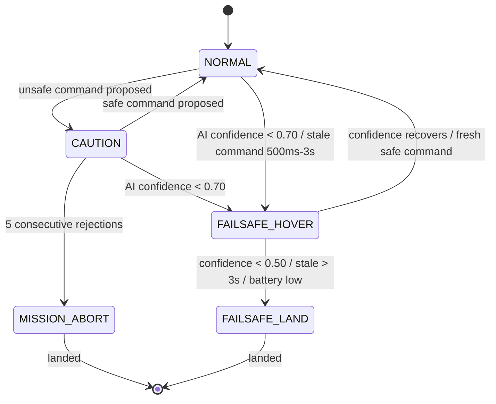

# Runtime Assurance Layer (Safety Gate)

Implementation: [`ros2_ws/src/sentinel_flight_control/sentinel_flight_control/safety_gate.py`](../ros2_ws/src/sentinel_flight_control/sentinel_flight_control/safety_gate.py)
Tests: [`tests/test_safety_gate.py`](../tests/test_safety_gate.py)

The AI perception and mission planner components are allowed to be wrong,
slow, or overconfident. The safety gate exists so that none of those
failure modes ever reach the flight controller as an unsafe command.

## Constraints enforced, in evaluation order

1. **Stale command timeout** — no proposed command for 500ms → hover; for
   3s → land. Protects against a hung or crashed mission planner.
2. **Battery** — below 15% → land immediately, regardless of mission state.
3. **Repeated rejections** — 5 consecutive unsafe proposals → `MISSION_ABORT`
   and land. Protects against a mission planner stuck proposing bad
   commands.
4. **AI confidence** — below 0.70 → hover; below 0.50 → land.
5. **Obstacle proximity** — obstacle detected within 2m → reject forward
   motion, hold position.
6. **Altitude limit** — must stay within [1m, 20m].
7. **Velocity limit** — max 3 m/s horizontal, 1 m/s vertical.
8. **Geofence** — must stay within x:[-20,20], y:[-20,20] meters.

Anything that clears all checks is `APPROVED` and passed through unchanged.

## State machine



## Test matrix

| Test case | Expected behavior | Covered by |
|---|---|---|
| AI confidence < 0.70 | Hover | `test_low_confidence_triggers_hover` |
| AI confidence < 0.50 | Land | `test_critical_confidence_triggers_land` |
| Command outside geofence | Reject | `test_rejects_command_outside_geofence` |
| Altitude > max / < min | Reject | `test_rejects_altitude_above_max`, `test_rejects_altitude_below_min` |
| Velocity too high (horizontal/vertical) | Reject | `test_rejects_excessive_horizontal_velocity`, `test_rejects_excessive_vertical_velocity` |
| No command for 500ms | Hover | `test_stale_command_under_3s_triggers_hover` |
| No command for 3s | Land | `test_stale_command_over_3s_triggers_land` |
| Obstacle ahead (<2m) | Reject forward motion | `test_obstacle_within_proximity_rejects_forward_motion` |
| Battery low | Land | `test_low_battery_triggers_land_regardless_of_command` |
| 5 consecutive unsafe proposals | Mission abort + land | `test_repeated_unsafe_commands_trigger_mission_abort` |
| Safe command after rejections | Rejection counter resets | `test_approval_resets_consecutive_rejection_counter` |

Run the suite:

```bash
pytest tests/test_safety_gate.py -v
```

All 14 cases currently pass (see [roadmap.md](roadmap.md) for what's
implemented vs. planned). A full `validation_report.md` with simulation-based
fault injection (Phase 9 of the original design doc) will be added once the
PX4/Gazebo pipeline is running — see the roadmap.
